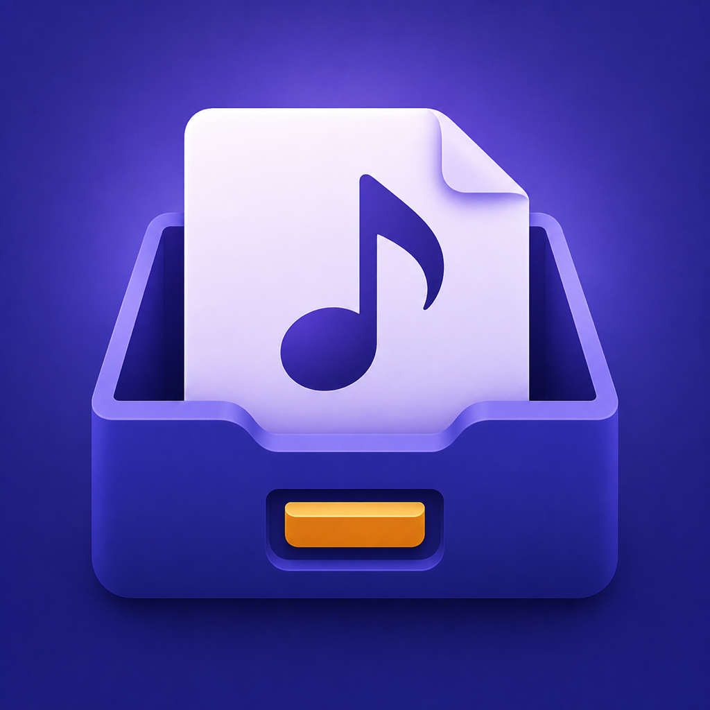
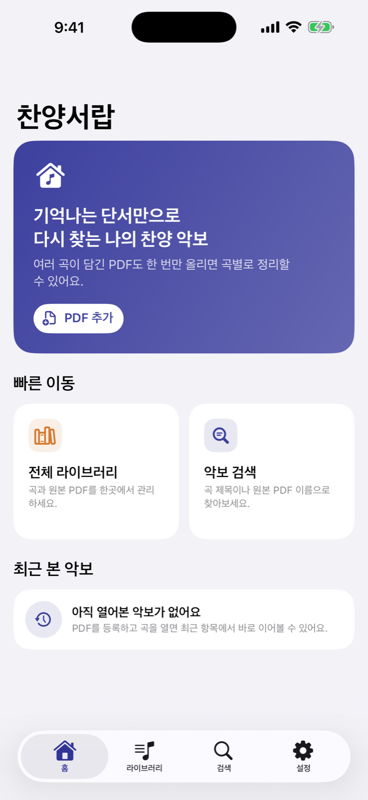
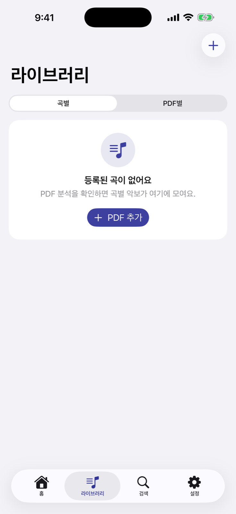
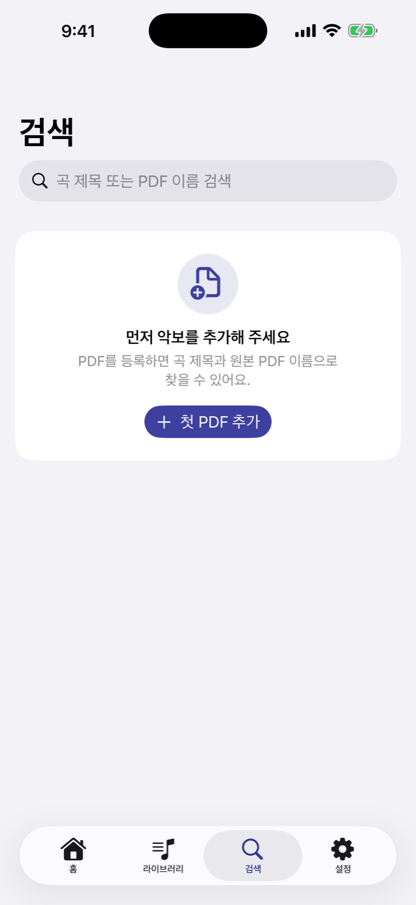

<p align="center">
  
</p>

<h1 align="center">찬양서랍</h1>

<p align="center">
  여러 곡이 담긴 찬양 악보 PDF를 곡별로 정리하고<br>
  제목, 원본 PDF 이름, 키로 다시 찾을 수 있는 iPhone·iPad 앱
</p>

<p align="center">
  <strong>SwiftUI · SwiftData · PDFKit · Vision · CloudKit</strong>
</p>

## 소개

찬양팀에서 사용하는 콘티 PDF에는 여러 곡이 한 파일에 함께 들어 있는 경우가 많습니다. 시간이 지나면 원하는 악보가 어느 PDF에 있었는지 기억하기 어렵고, 한 곡만 다시 열거나 공유하기도 번거롭습니다.

찬양서랍은 PDF를 한 번 가져오면 내장 텍스트와 기기 내 OCR을 이용해 곡 제목, 페이지 범위, 키를 제안합니다. 사용자가 결과를 확인하고 수정한 뒤 저장하면 각 곡을 독립된 악보처럼 검색하고 열고 공유할 수 있습니다.

`PDF 가져오기 → 자동 분석 → 곡 범위 제안 → 사용자 확인 → 라이브러리 저장 → 검색·열기·공유`

> 현재 상태: App Store 1.0 출시 준비 중

## UI 미리보기

<p align="center">
  
  
  
</p>

<p align="center">
  <sub>홈 · 라이브러리 · 검색</sub>
</p>

## 주요 기능

| 기능 | 설명 |
| --- | --- |
| PDF 가져오기 | 파일 앱에서 선택하거나 Goodnotes 등 다른 앱의 공유 메뉴에서 PDF를 바로 가져옵니다. |
| 곡 자동 분류 | PDF 내장 텍스트를 우선 사용하고 필요한 페이지만 Vision OCR로 분석합니다. |
| 제목·페이지 제안 | 송폼, 크레딧, 연주 지시를 걸러 곡 제목과 곡별 페이지 범위를 보수적으로 제안합니다. |
| 키 자동 인식 | 오선의 `♯`·`♭` 개수를 비교해 12개 키 중 하나를 제안합니다. |
| 저장 전 검토 | 제목, 키, 시작·끝 페이지를 직접 수정하고 곡을 추가하거나 제외할 수 있습니다. |
| 라이브러리 | 곡별·PDF별 보기, 즐겨찾기, 키 필터, 동일한 곡 묶기를 지원합니다. |
| 검색 | 곡 제목과 원본 PDF 이름으로 빠르게 찾을 수 있습니다. |
| 곡 전용 뷰어 | 선택한 곡의 페이지 범위만 PDFKit으로 열고 마지막으로 본 페이지를 기억합니다. |
| 수정·삭제 | 저장 후 곡의 키를 수정하고 곡 또는 원본 PDF를 삭제할 수 있습니다. |
| 곡별 PDF 공유 | 현재 곡의 페이지만 새 PDF로 만들어 시스템 공유 시트로 전달합니다. |
| 오프라인·동기화 | 데이터를 기기에 먼저 저장하고 사용 가능한 경우 비공개 iCloud 공간과 동기화합니다. |
| iPhone·iPad 대응 | 화면 크기에 맞춰 탭과 사이드바가 적응하는 공용 인터페이스를 사용합니다. |

## 분석 원칙

- 원본 PDF는 앱 전용 저장소에 한 번만 보관합니다.
- 곡마다 원본 문서와 페이지 범위를 연결해 불필요한 파일 복제를 줄입니다.
- 내장 텍스트가 충분하면 OCR을 생략하고, 부족한 페이지만 한국어·영어 OCR을 실행합니다.
- 자동 분석 결과를 바로 확정하지 않고 반드시 사용자 검토 단계를 거칩니다.
- 조표는 여러 오선에서 감지한 `♯`·`♭` 개수가 일치할 때만 키를 제안합니다.
- 곡을 열거나 공유할 때는 해당 곡의 페이지 범위만 분리해 다른 곡이 노출되지 않게 합니다.
- 손상 파일, 중복 가져오기, 취소, 저장 실패와 CloudKit 오류에서도 로컬 원본을 우선 보호합니다.

## 기술 구성

| 영역 | 사용 기술 |
| --- | --- |
| UI | SwiftUI |
| 로컬 데이터 | SwiftData |
| PDF 저장·표시·분리 | PDFKit, FileManager |
| 문자 인식 | Vision OCR |
| 키 인식 | Vision/Core Graphics 기반 조표 영역 분석 |
| 기기 간 동기화 | CloudKit private database |
| 무결성 확인 | CryptoKit SHA-256 |
| 테스트 | XCTest |

외부 패키지나 광고·분석 SDK는 사용하지 않습니다.

## 아키텍처

화면은 MVVM을 기준으로 구성합니다.

```mermaid
flowchart LR
    View[SwiftUI View] -->|사용자 입력| ViewModel[@MainActor @Observable ViewModel]
    ViewModel -->|도메인 규칙| Domain[Domain]
    ViewModel -->|프로토콜 호출| Service[Services]
    Service --> Infrastructure[Files · Vision · CloudKit]
    Query[SwiftData @Query] --> View
    View -->|현재 모델 전달| ViewModel
```

- **View**: SwiftUI 레이아웃, 화면 전환, `@Query` 결과 전달만 담당합니다.
- **ViewModel**: 화면 상태, 사용자 작업, 비동기 흐름과 오류 복구를 담당합니다.
- **Domain**: 검색·페이지 범위·키 판정·편집처럼 UI와 무관한 규칙을 담당합니다.
- **Services**: PDF 저장·분석·동기화 기능의 프로토콜 경계를 정의합니다.
- **Infrastructure**: PDFKit, Vision, CloudKit, 파일 시스템 구현을 담당합니다.

PDF 가져오기의 `PDFImportCoordinator`는 파일 준비→분석→사용자 검토→저장으로 이어지는 상태가 많은 기능 전용 ViewModel입니다.

## 프로젝트 구조

```text
WorshipArchive/
├── App/                    # 앱 서비스 조립과 화면 목적지
├── Components/             # 공용 SwiftUI 컴포넌트
├── Design/                 # 색상과 화면 테마
├── Domain/
│   ├── Analysis/           # 제목·페이지·키 제안 로직
│   ├── Import/             # PDF 가져오기 초안과 상태
│   ├── Models/             # SwiftData 모델과 편집 규칙
│   └── Search/             # 검색 정규화·필터 로직
├── Features/
│   ├── Home/               # 홈과 최근 본 악보
│   ├── Import/             # PDF 선택·분석·검토
│   ├── Library/            # 곡·PDF 라이브러리와 편집
│   ├── Search/             # 곡 제목·PDF 이름 검색
│   ├── Settings/           # iCloud 상태와 앱 정보
│   └── Viewer/             # 곡 전용 PDF 뷰어와 공유
├── Infrastructure/
│   ├── Analysis/           # PDF 텍스트 추출과 Vision OCR
│   ├── Cloud/              # CloudKit 자산 동기화
│   ├── Files/              # 로컬 PDF 저장과 복구
│   └── Persistence/        # SwiftData 컨테이너
└── Services/               # 기능 경계 프로토콜

WorshipArchiveTests/        # 분석·검색·저장·동기화·뷰어 테스트
Docs/                       # 구현 계획과 출시 문서
```

## 개발 환경

- Xcode 26.5 이상
- iOS/iPadOS 26.5 이상
- Swift 5
- CloudKit 기능을 실행하려면 Apple Developer Team과 iCloud 컨테이너가 필요합니다.

## 실행 방법

1. 저장소를 복제합니다.

   ```bash
   git clone https://github.com/ji-seok-Song/WorshipArchive.git
   cd WorshipArchive
   ```

2. `WorshipArchive.xcodeproj`를 Xcode에서 엽니다.
3. `WorshipArchive` 타깃의 **Signing & Capabilities**에서 사용할 Team을 선택합니다.
4. 저장소 소유자는 등록된 App ID와 `iCloud.com.jacky.WorshipArchive` 컨테이너 연결을 확인합니다.
5. iOS 26.5 이상의 iPhone 또는 iPad 시뮬레이터/기기를 선택하고 실행합니다.

### 다른 Developer Team에서 포크해 실행하는 경우

Apple의 App ID와 CloudKit 컨테이너는 원래 개발자 Team에 귀속됩니다. 다른 Team에서는 다음 값을 자신의 식별자로 바꿔야 합니다.

1. Xcode의 `PRODUCT_BUNDLE_IDENTIFIER`
2. `WorshipArchive/WorshipArchive.entitlements`의 iCloud 컨테이너와 key-value store 식별자
3. `AppModelContainer.cloudKitContainerIdentifier`
4. Apple Developer에서 생성한 App ID와 CloudKit 컨테이너 연결

App Store 또는 TestFlight 빌드를 만들기 전에는 CloudKit Development 스키마를 Production으로 배포해야 합니다.

## 테스트

Xcode에서 **Product → Test**를 선택하거나 다음 명령을 실행합니다. 설치된 시뮬레이터 이름은 환경에 맞게 바꿀 수 있습니다.

```bash
xcodebuild \
  -project WorshipArchive.xcodeproj \
  -scheme WorshipArchive \
  -destination 'platform=iOS Simulator,name=iPhone 17' \
  test
```

테스트는 다음 영역을 포함합니다.

- PDF 가져오기, 중복·취소·손상 파일 방어
- 내장 텍스트와 Vision OCR 분석
- 곡 제목, 페이지 범위, 조표 기반 키 제안
- 곡 검색, 키 필터, 즐겨찾기와 동일 곡 묶기
- 로컬 저장 복구와 파일 무결성
- CloudKit 업로드·다운로드·재시도
- 곡 범위 전용 뷰어와 PDF 공유

## 개인정보와 저작권

- OCR과 곡 분석은 사용자의 기기에서 수행합니다.
- 별도 개발자 서버, 광고, 사용자 추적, 제3자 분석 도구를 사용하지 않습니다.
- PDF와 악보 정보는 먼저 기기에 저장되며, iCloud 사용 시 사용자의 비공개 CloudKit 데이터베이스에 동기화됩니다.
- 실제 악보 PDF와 개인 자료는 저장소에 포함하지 않습니다.
- 사용자는 가져오거나 공유하는 악보에 필요한 권리를 보유해야 합니다.

자세한 내용은 [개인정보처리방침](https://ji-seok-song.github.io/WorshipArchive/privacy/)을 참고하세요.

## 문서

- [구현 계획](Docs/IMPLEMENTATION_PLAN.md)
- [App Store 배포 체크리스트](Docs/APP_STORE_RELEASE_CHECKLIST.md)
- [개인정보처리방침](Docs/PRIVACY_POLICY.md)
- [사용자 지원](Docs/SUPPORT.md)
- [공개 지원 페이지](https://ji-seok-song.github.io/WorshipArchive/)

## 라이선스

현재 별도의 오픈 소스 라이선스가 없습니다. 따라서 코드와 디자인 자산의 복제, 수정, 재배포 권한은 자동으로 부여되지 않습니다.
